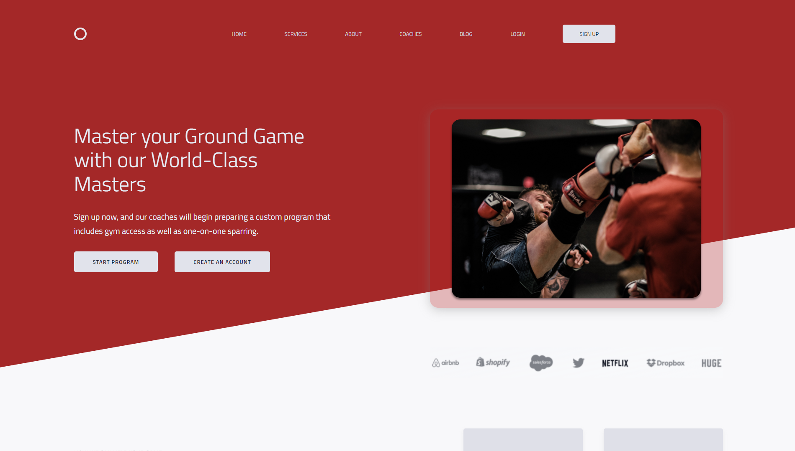

# Jitsuno
A responsive, professional site for Jitsuno MMA Gym looking to show off their brand. Built with Gird and Flexbox to achieve a sleek and modern design.

**Link to project:** https://jitsunomma.netlify.app/

## How It's Made:

**Tech used:** HTML, CSS

This website is made with just HTML and CSS. It is fully responsive and uses Grid and Flex throughout to achieve a fluid, responsive feel. It has placeholders for whichever pictures the client would like to add.

## Optimizations

Optimizations for the future would include refactoring code, compressing pictures, and adding more browser support per client's need.

## Lessons Learned:

I learned a lot about how to layout a website during this project. This was the first real sophisticated layout I've tried to tackle, and I leanred a lot about element spacing, accessability, and responsive design.
